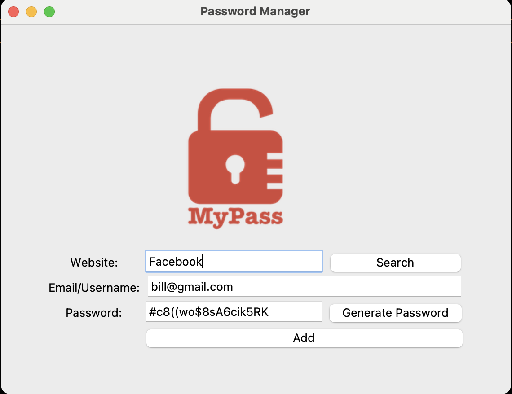
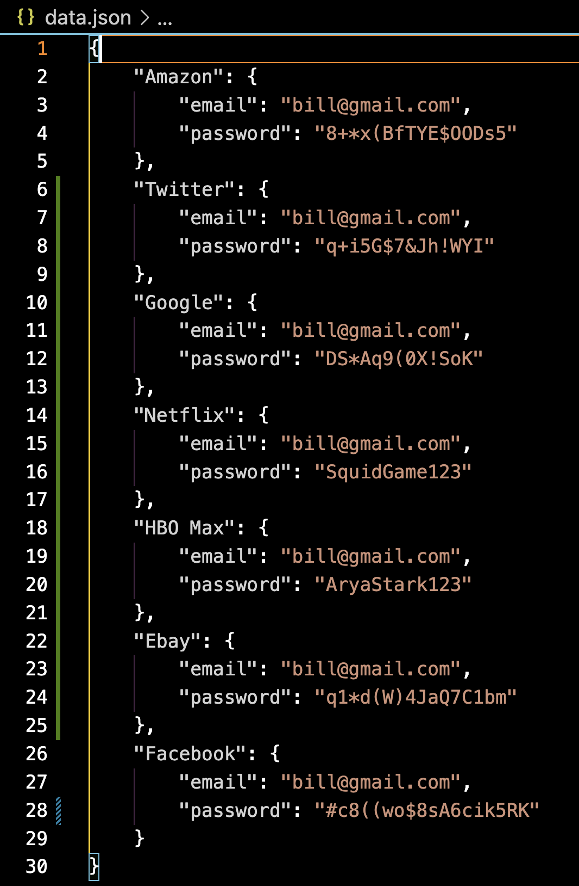
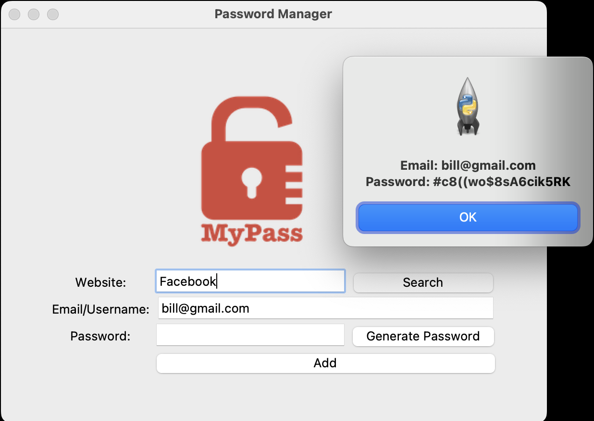

# Password Manager 

  ## Description

  This is an app for managing passwords. User can create their own password or can choose to randomly generate it.  Passwords are saved to a json file.  Also, when a password is randomly generated, it is automatically saved to the clipboard so that user can simply paste it when signing up for a new website.  The user can then retrieve passwords by searching by website.

  Screenshot of app:  Enter details and hit 'add':

  

  Screenshot of json file as passwords are saved:

  

  Screenshot of searching for a password:

  
  
  
  ## Table of Contents
  
  - [Installation](#installation)
  - [Usage](#usage)
  - [License](#license)
  - [Contributing](#contributing)
  - [Tests](#tests)
  - [Questions](#questions)
  
  ## Installation
  
  run main.py in terminal
  
  ## Usage
  
  Enter a website, your email or username into the form.  Then you can either 1) Generate a random password by pressing the "Generate Password" button, or 2) Create your own password by entering.  Then click the add button, and the details will be saved to a data.json file.  Once at least one password has been added to the Password Manager, the user will be able to search for a password by simply typing the website into the website box and hitting the search button.

  ## License
This application is covered under the MIT License.
 For more information: https://opensource.org/licenses/MIT
  
  ## Contributing
  N/A
  
  ## Tests
  N/A

  ## Questions
  Contact Info 
  GitHub user name: BillStephens2022 
  Link to GitHub profile: https://github.com/BillStephens2022 
  Email: stephensbill17@gmail.com